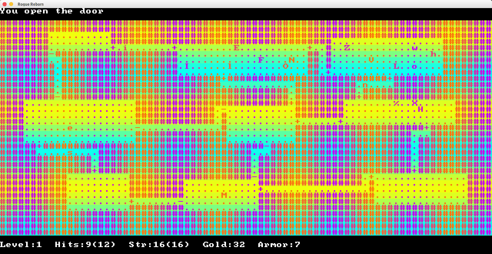

# Rogue Reborn
##### **Team Name:** Team Rogue++
##### **Contributors:** Or Almog, Mikhail Andrenkov, Ian Prins
---
#### About

 This project is a reimplementation of the classic <i>Rogue</i> terminal game that was released in 1980.

---
#### Original Repository

 This project was originally developed on <a href="https://gitlab.cas.mcmaster.ca/andrem5/RogueReborn">GitLab</a>.

---
#### Source

 The original Rogue source code is available <a href="https://github.com/weiss/original-bsd/tree/master/games/rogue">here</a>.

---
#### Repository Layout

 The repository file system is structured in the following way:  

| **Directory**                               |  **Description**       |
| :--------:                                  | :--------:             |
| [Doc/](Doc)                                 |  Project documentation |
| [src/](src)                                 |  Source code           |
| [ProjectSchedule/](ProjectSchedule)         |  Project schedule      |

### Screenshot

